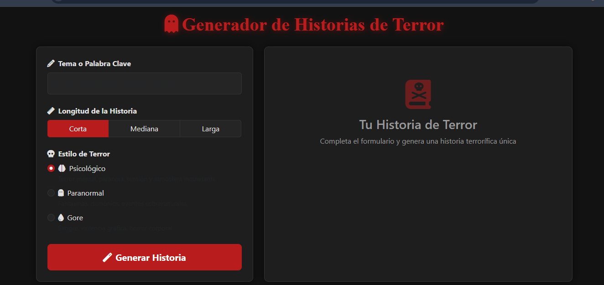

# Generador de Historias de Terror

Una aplicación interactiva para generar historias de terror únicas y personalizadas. ¡Elige el tema, la longitud y el estilo de terror, y deja que la magia ocurra!

## Descripción

El Generador de Historias de Terror es una herramienta diseñada para crear historias de terror basadas en parámetros personalizados. Puedes seleccionar el tema, la longitud y el estilo de terror (psicológico, paranormal, gore) para obtener una historia única. Además, puedes descargar las historias generadas en formatos TXT, PDF o HTML.

## Características

- Generación de historias de terror personalizadas.
- Selección de tema, longitud y estilo de terror.
- Descarga de historias en formatos TXT, PDF y HTML.
- Interfaz interactiva y fácil de usar.
- Notificaciones de éxito al descargar historias.

## Tecnologías Utilizadas

- **Python**: Backend principal para la lógica de generación de historias.
- **Eel**: Framework para crear aplicaciones de escritorio con tecnologías web.
- **HTML, CSS, JavaScript**: Desarrollo de la interfaz de usuario.
- **Bootstrap 5**: Diseño responsivo y estilizado.
- **Font Awesome**: Iconos para mejorar la experiencia visual.

## Requisitos

Antes de comenzar, asegúrate de tener instalado lo siguiente:

- Python 3.8 o superior
- pip (gestor de paquetes de Python)
- Navegador web moderno (Chrome, Firefox, Edge, etc.)

## Instalación

Sigue estos pasos para instalar y ejecutar la aplicación:

1. Clona este repositorio en tu máquina local:
```bash
    git clone https://github.com/Fishertdevs/GeneradorHistoriasTerror.git
    cd GeneradorHistoriasTerror
    pip install -r requirements.txt
```

## Preview

---
- Desarrollado por Harry Fishert